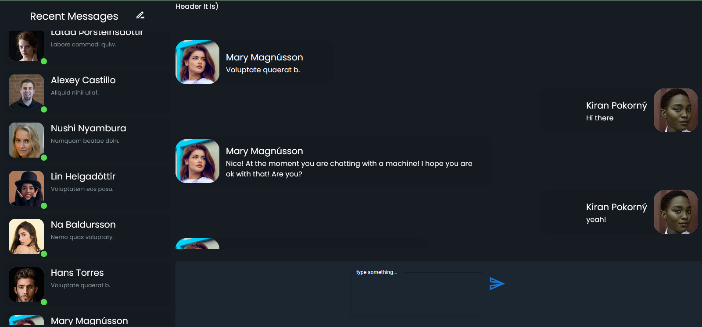

# rasa messenger
a simple and easy to use messenger with a simple chat-bot!

technologies:

    react.js
    next.js
    node.js
    socket.io
    express.js
    material-ui

# screenshots

this is still being developed and is not yet ready for use!

how to use:

    // please note that server should be started first!
    // install server dependencies
    yarn run server-intsall
    // install client dependencies
    yarn install
    // start server
    yarn run server
    // start client
    yarn dev
